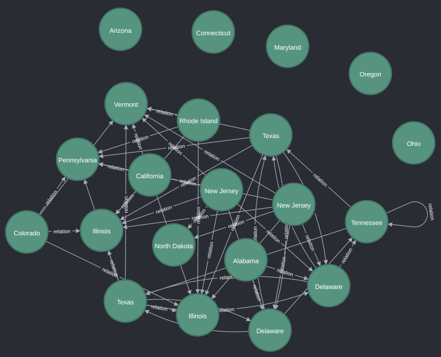

## INTRODUCTION

This repo read the given excel file and create tree from data of the excel file. For create tree, use `Pandas` and for to store the tree use `Neo4j`.

* [INTRODUCTION](#introduction)
* [USED TECHNOLOGIES](#used-technologies)
* [WHY](#why)
    * [Why Neo4j](#why-neo4j)
    * [Why Pandas](#why-pandas)
* [INSTALL](#install)
    * [NEO4j](#neo4j)
    * [Python](#python)
* [HOW TO RUN AND HOW TO WORK?](#how-to-run-and-how-to-work)
* [RESULT](#result)

## USED TECHNOLOGIES

Tecnology | Information
----------|------------
Python | As a Programming language
Pandas    | For to read from given excel file and transform it and filter it and to create the tree.
Neo4j     | For to store the tree
Docker    | As Neo4j environment

## WHY

### Why Neo4j

Purpose of the project is that create relationship between `assets`. For this purpose, most usefull database is a Graph based database. `Neo4j` is a Graph based database.

### Why Pandas

`Pandas` can reads various file format such as `csv`, `parquet`, `excel` and `Pandas` transform the readed data to `Pandas DataFrame`. `Pandas` can make various operations on data such as filter, group by, order by, merge.

## INSTALL

### NEO4j

This project use `Docker` as `Neo4j` environment. If you don't use `Docker` you can read this [doc](https://neo4j.com/docs/operations-manual/current/installation/) for installing `Neo4j`. If you use `Docker` run following command at root directory of the project::

```
docker compose up -d
```

> username: `neo4j`, password: `test1234?_`
> For connect to `Neo4j browser` you visit http://localhost:7474/


### Python

Run following command at root directory of the project:

```
pip install -r requirenments.txt
```

## HOW TO RUN AND HOW TO WORK?

For run the project run following command at root directory of the project:

```
python main.py
```

after run above command, the program:

* reads the excel file with `pandas`
* creates `nodes` from `assets` sheet from the excel file to Neo4j
* find outs matching `asset`s
* creates relationship between `asset nodes` in Neo4j

## RESULT


